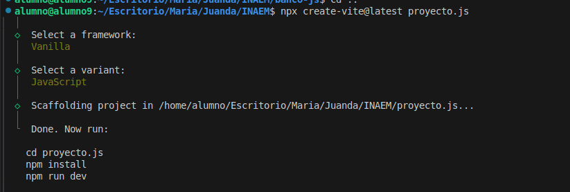

# proyecto-js



# Para

- npm install
- npm install gh-pages --save-dev
- npm run deploy
- npm run build

## intalar vite

- npm install vite --save-dev

# APP


He creado una aplicación web completa para buscar libros utilizando la API de OpenLibrary. La aplicación incluye:
Un formulario de búsqueda con:
Campo de entrada para el título del libro
Botón de búsqueda
Mensajes de error
Contenedor para mostrar los resultados
Funcionalidades implementadas:
Búsqueda asíncrona usando fetch
Gestión de errores completa
Visualización de resultados en tarjetas
Diseño responsive
Manejo de casos donde no hay imagen disponible
Para usar la aplicación:
Simplemente abre el archivo main.js en tu navegador
Escribe el título del libro que quieres buscar
Haz clic en el botón "Buscar"
La aplicación mostrará:
Una imagen de la portada del libro (si está disponible)
El título del libro
El nombre del autor
El año de primera publicación
Si hay algún error en la búsqueda o la API no responde, se mostrará un mensaje de error apropiado.
¿Te gustaría probar la aplicación o necesitas alguna modificación específica?

# Despliegue

## Despliegue en GitHub Pages

La aplicación está configurada para desplegarse automáticamente en GitHub Pages.

### Despliegue Manual

1. Asegúrate de tener los cambios guardados y commiteados:

```bash
git add .
git commit -m "Actualización para despliegue"
```

2. Ejecuta el comando de despliegue:

```bash
npm run deploy
```

3. La aplicación estará disponible en: https://TuUsuario.github.io/proyecto-js

### Despliegue Automático

El despliegue se realizará automáticamente cuando:

- Se haga push a la rama main
- Se cree un nuevo release
- Se ejecute el workflow de GitHub Actions

### Configuración de GitHub Pages

1. Ve a la configuración del repositorio en GitHub
2. Navega a la sección "Pages"
3. En "Source", selecciona la rama "gh-pages"
4. Guarda los cambios

### Scripts de Despliegue

- `npm run build`: Construye la aplicación para producción
- `npm run deploy`: Despliega la aplicación en GitHub Pages

## Despliegue en Servidor Propio

Si prefieres desplegar la aplicación en tu propio servidor, sigue estos pasos:

1. Construye la aplicación:

```bash
npm run build
```

2. Los archivos de producción estarán en la carpeta `dist`

3. Sube los archivos de la carpeta `dist` a tu servidor web

### Usando Docker (Opcional)

Si prefieres usar Docker, puedes crear un contenedor con Nginx:

1. Crea un archivo `Dockerfile`:

```dockerfile
FROM nginx:alpine
COPY dist /usr/share/nginx/html
EXPOSE 80
CMD ["nginx", "-g", "daemon off;"]
```

2. Construye la imagen:

```bash
docker build -t buscador-libros .
```

3. Ejecuta el contenedor:

```bash
docker run -d -p 80:80 buscador-libros
```

La aplicación estará disponible en `http://localhost:80`

# Control de Versiones

## Commits Realizados

1. **feat: Inicialización del proyecto con Vite y configuración básica**

   - Configuración inicial de Vite
   - Creación de package.json
   - Configuración de scripts básicos

2. **feat: Implementación del formulario de búsqueda y estructura HTML básica**

   - Creación del formulario de búsqueda
   - Estructura HTML básica
   - Elementos de la interfaz de usuario

3. **feat: Implementación de la lógica de búsqueda y conexión con la API de OpenLibrary**

   - Integración con la API de OpenLibrary
   - Implementación de la función de búsqueda
   - Manejo de respuestas y errores

4. **style: Implementación de estilos CSS y mejora de la interfaz de usuario**

   - Estilos para el formulario
   - Diseño de tarjetas de libros
   - Diseño responsive
   - Mejoras visuales generales

5. **chore: Configuración del despliegue con GitHub Pages y Docker**
   - Configuración de GitHub Pages
   - Configuración de Docker
   - Scripts de despliegue
   - Documentación de despliegue
